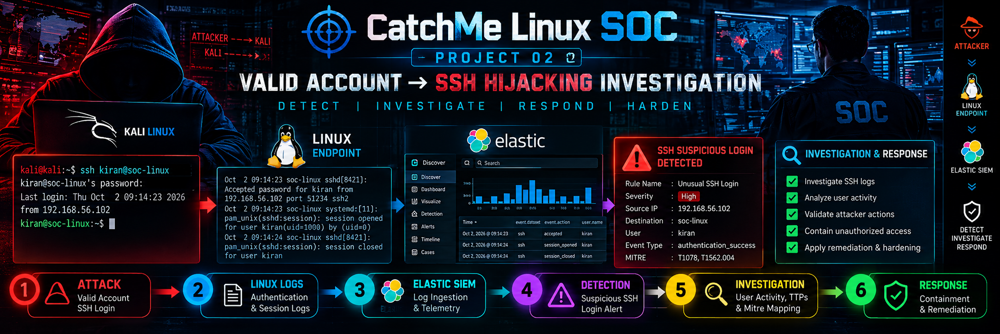

# CatchMe Linux SOC — Project 02
# Valid Account → SSH Hijacking Investigation



## Project Overview

This project demonstrates a complete SOC investigation of a **Valid Account Abuse scenario involving SSH access** against a Linux endpoint.

The objective is to simulate an attacker using legitimate credentials to access a Linux system and investigate the resulting authentication activity, user behaviour, endpoint telemetry, and potential post-login actions.

The investigation follows a real SOC workflow:

```text
Valid Account Usage
        ↓
SSH Authentication
        ↓
Endpoint Telemetry
        ↓
Threat Hunting
        ↓
Detection Engineering
        ↓
Alert Investigation
        ↓
Evidence Correlation
        ↓
MITRE ATT&CK Mapping
        ↓
Incident Response
        ↓
Lessons Learned
```

---

# Scenario

A valid Linux account is abused to gain SSH access to a monitored endpoint.

The SOC team must determine:

* Was the login legitimate?
* Who authenticated?
* Where did the authentication originate?
* What activity occurred after login?
* Was the account compromised?
* Did the attacker perform suspicious actions?
* What evidence supports the investigation?

---

# Lab Environment

## Architecture

```text
                    CatchMe SOC Lab


┌──────────────────┐
│   Kali Linux     │
│    Attacker      │
│ 192.168.1.10     │
└────────┬─────────┘
         │
         │ SSH Authentication
         │ TCP/22
         ▼

┌──────────────────┐
│   SOC-LINUX      │
│ Linux Endpoint   │
│ 192.168.1.16     │
│                  │
│ OpenSSH          │
│ Elastic Agent    │
│ Auditd           │
└────────┬─────────┘
         │
         │ Telemetry
         ▼

┌──────────────────┐
│   Elastic SIEM   │
│ 192.168.1.11     │
│                  │
│ Elasticsearch    │
│ Kibana           │
│ Fleet Server     │
│ Detection Engine │
└──────────────────┘
```

---

# Lab Mapping

| System         | Hostname     | IP           | Role                     |
| -------------- | ------------ | ------------ | ------------------------ |
| Kali Linux     | kiran        | 192.168.1.10 | Attack simulation        |
| Linux Endpoint | soc-linux    | 192.168.1.16 | Target system            |
| Elastic SIEM   | elastic-siem | 192.168.1.11 | Monitoring and detection |

---

# Investigation Objective

The project focuses on identifying and investigating:

## Authentication Activity

* Successful SSH authentication
* Source IP analysis
* User validation
* Login behaviour

## Post-Login Activity

* Command execution
* Shell activity
* Process execution
* User behaviour

## Persistence Review

* SSH authorized keys
* User accounts
* Scheduled tasks
* System changes

---

# Expected Telemetry

The investigation uses telemetry from:

## Linux Authentication Logs

```text
/var/log/auth.log
journalctl -u ssh
```

## Elastic Telemetry

Important fields:

```text
event.action
event.category
user.name
source.ip
host.name
process.name
process.command_line
```

## Audit Telemetry

```text
Auditd
Process activity
User activity
```

---

# Project Workflow

## 00 — Pre Attack

Environment verification and baseline collection.

Includes:

* Lab validation
* SSH configuration
* User baseline
* Authorized key review
* Service status

Location:

```text
00-pre-attack/
```

---

## 01 — Attack Simulation

Controlled valid-account SSH activity.

Location:

```text
01-attack/
```

---

## 02 — Telemetry Validation

Validation of:

* Linux SSH logs
* Elastic events
* Process telemetry
* Authentication records

Location:

```text
02-telemetry/
```

---

## 03 — Threat Hunting

Investigation using Elastic Discover and KQL.

Focus areas:

* Successful SSH login analysis
* Source IP correlation
* User behaviour
* Suspicious activity

Location:

```text
03-threat-hunting/
```

---

## 04 — Detection Engineering

Detection development based on observed behaviour.

Includes:

* Detection logic
* Query development
* Rule configuration
* Validation

Location:

```text
04-detection/
```

---

## 05 — Investigation

SOC analyst investigation process.

Includes:

* Alert analysis
* Timeline creation
* Evidence correlation
* Findings

Location:

```text
05-investigation/
```

---

## 06 — MITRE ATT&CK Mapping

Technique mapping based on observed activity.

Expected techniques:

| Technique | Description              |
| --------- | ------------------------ |
| T1078     | Valid Accounts           |
| T1021.004 | Remote Services: SSH     |
| T1059.004 | Unix Shell (if observed) |

Location:

```text
06-mitre/
```

---

## 07 — Incident Response

Documentation of:

* Incident report
* Containment
* Remediation
* Lessons learned

Location:

```text
07-incident-response/
```

---

# Evidence Structure

```text
11-Evidence/

├── Raw
│
├── Sanitized
│
└── Hashes
```

Evidence handling principles:

* Collect real telemetry
* Preserve original evidence
* Sanitize sensitive information
* Generate SHA256 hashes after final collection

---

# Query Structure

```text
10-Queries/

├── KQL
│
└── supporting-queries
```

Contains:

* Hunting queries
* Detection queries
* Investigation queries
* Validation queries

---

# Screenshots

```text
09-Screenshots/

├── Attack
├── Telemetry
├── Hunting
├── Detection
└── Investigation
```

Screenshots document the complete SOC workflow.

---

# Diagrams

```text
08-diagrams/
```

Visual documentation will cover:

* Lab architecture
* Attack flow
* Telemetry pipeline
* Detection workflow
* Investigation workflow
* Evidence correlation
* MITRE ATT&CK mapping

---

# Security Validation

The investigation will verify:

```text
Successful Authentication
          ↓
User Activity
          ↓
Process Behaviour
          ↓
Detection Opportunity
          ↓
SOC Investigation
```

---

# Important Investigation Principle

A successful login does not automatically mean compromise.

The SOC investigation must determine:

```text
Authentication
        +
Context
        +
User Behaviour
        +
Process Activity
        +
Evidence
```

before classifying the activity.

---

# Project Status

| Component             | Status         |
| --------------------- | -------------- |
| Lab Setup             | ✅ Complete     |
| Baseline Collection   | 🔄 In Progress |
| Attack Simulation     | Pending        |
| Telemetry Validation  | Pending        |
| Threat Hunting        | Pending        |
| Detection Engineering | Pending        |
| Investigation         | Pending        |
| MITRE Mapping         | Pending        |
| Incident Response     | Pending        |
| Evidence Collection   | Pending        |
| Documentation         | Pending        |

---

# Repository Structure

```text
02-Valid-Account-SSH-Hijacking/

├── README.md

├── 00-pre-attack
├── 01-attack
├── 02-telemetry
├── 03-threat-hunting
├── 04-detection
├── 05-investigation
├── 06-mitre
├── 07-incident-response
├── 08-diagrams
├── 09-Screenshots
├── 10-Queries
├── 11-Evidence
└── 12-Assets
```

---

# CatchMe Linux SOC Philosophy

> Every authentication event tells a story.

The goal is not only to detect activity, but to understand:

```text
Who accessed the system?
        ↓
How did they access it?
        ↓
What did they do?
        ↓
What evidence proves it?
        ↓
How should the SOC respond?
```

---

## Project 02

**Valid Account → SSH Hijacking Investigation**

```text
AUTHENTICATE → MONITOR → HUNT → DETECT → INVESTIGATE → RESPOND → DOCUMENT


This is the **initial GitHub README version**. After we complete the attack, telemetry, detections, and evidence, we will upgrade the status sections and add actual findings like Project 01.
```
